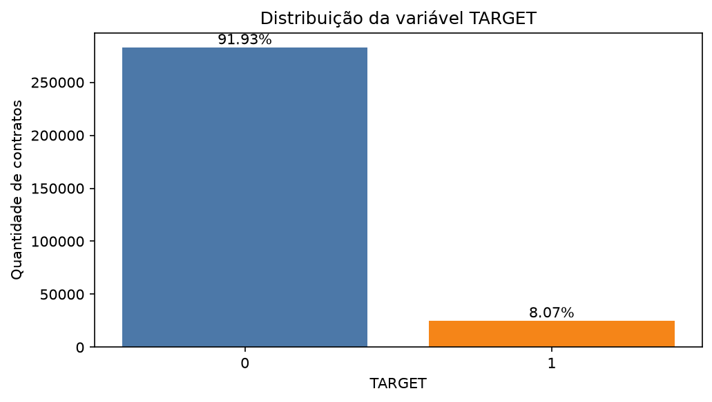
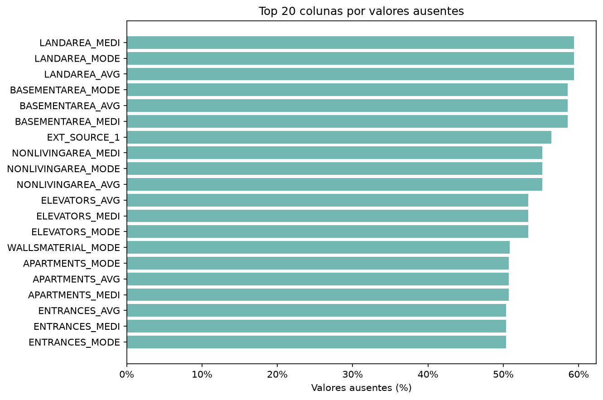
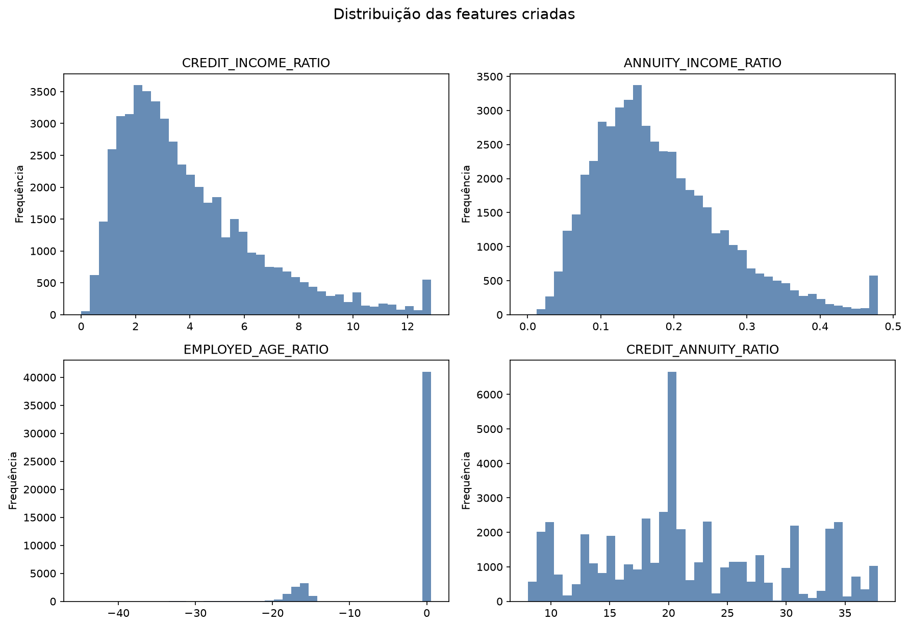
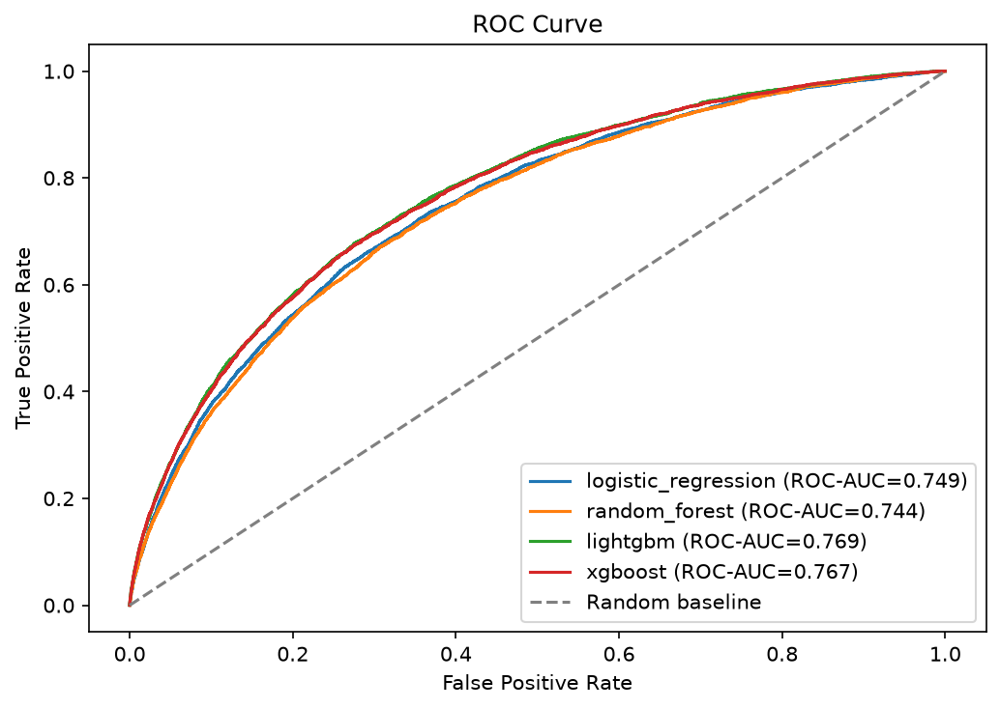
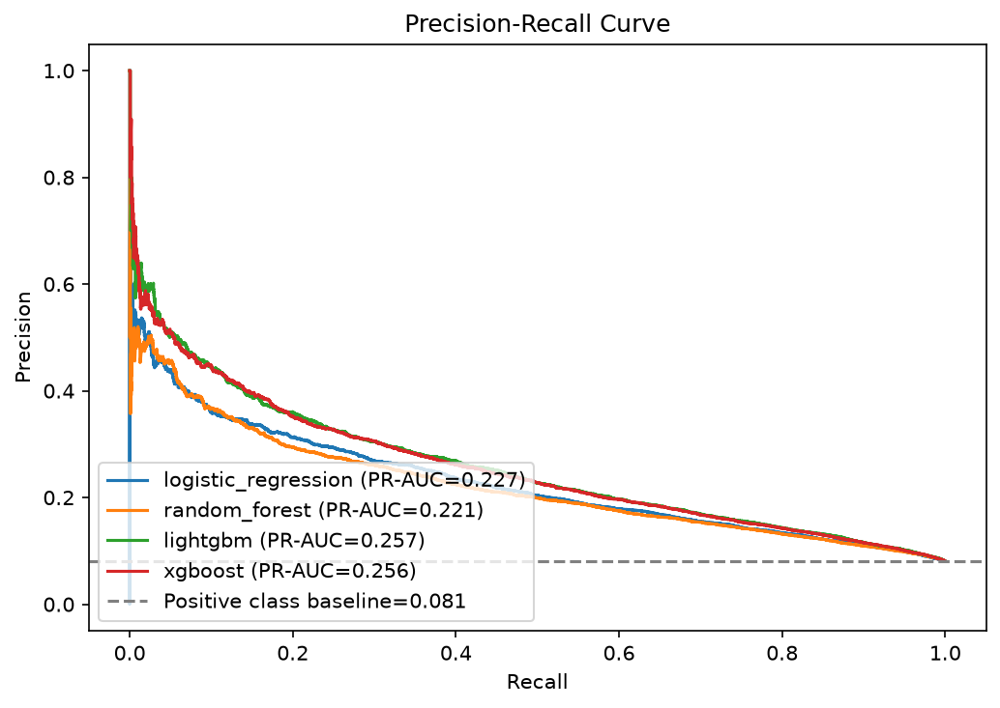
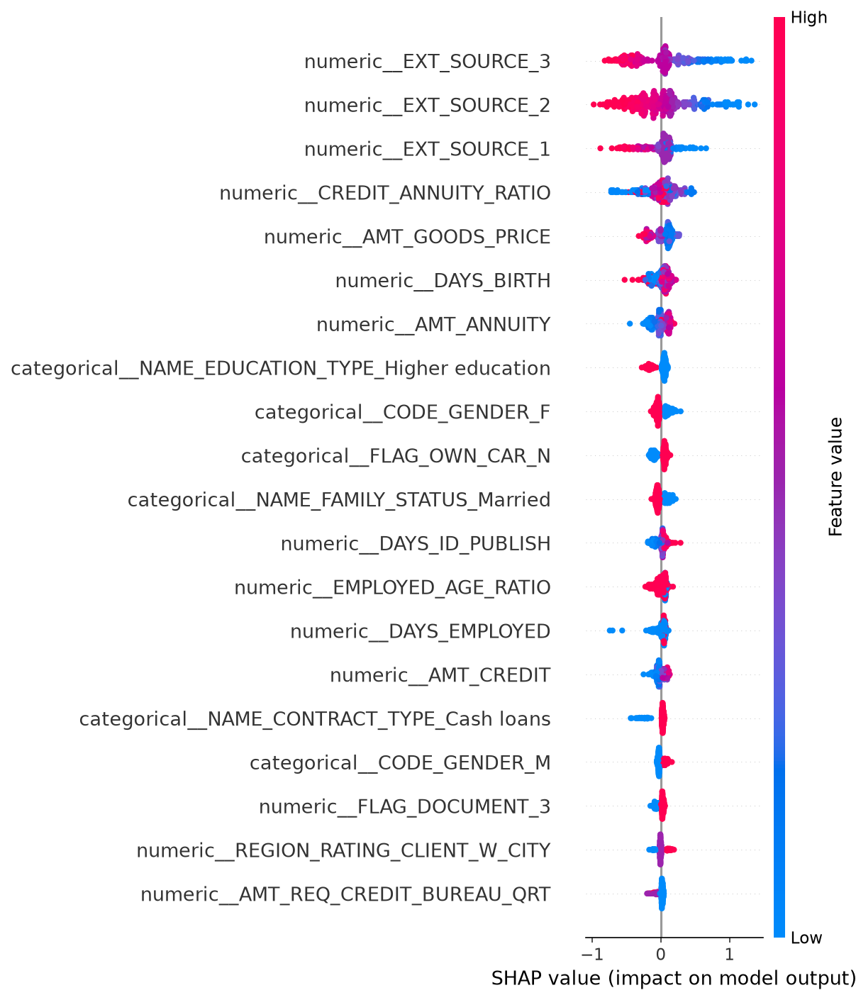
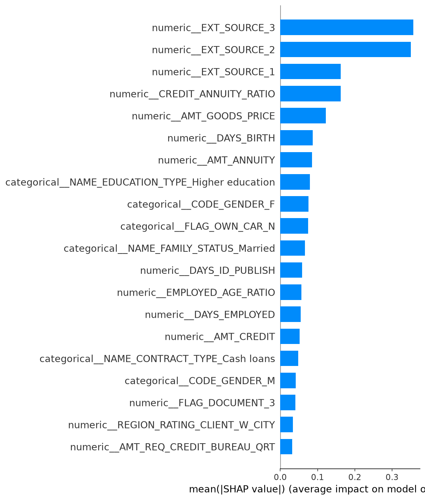

# Credit Risk Prediction with Machine Learning

Pipeline end-to-end para prever risco de inadimplência em crédito usando dados tabulares da competição Home Credit Default Risk. O projeto cobre preparação dos dados, EDA, feature engineering, comparação de modelos, explicabilidade e duas formas simples de consumo do modelo: API FastAPI e dashboard Streamlit.

[Live Demo](#) | [API Docs](#) | [LinkedIn Post](#)

## Business Problem

Instituições financeiras precisam estimar o risco de não pagamento antes de conceder crédito. Um modelo ruim pode negar crédito para bons clientes ou aprovar contratos com alto risco de inadimplência. Neste projeto, trato o problema como classificação binária: prever se uma solicitação pertence à classe `TARGET = 1`, que representa dificuldade de pagamento registrada na base.

Este repositório não propõe uma regra real de aprovação de crédito. A ideia é construir um fluxo técnico reproduzível e documentar os cuidados necessários para um problema sensível.

## Objective

Treinar e comparar modelos de machine learning para estimar probabilidade de inadimplência, com foco em:

- tratamento inicial de dados ausentes;
- criação de features financeiras simples;
- split treino/teste estratificado;
- comparação de modelos com métricas adequadas para classe desbalanceada;
- explicabilidade global do modelo;
- API e dashboard para simular previsões individuais.

## Dataset

O projeto usa o dataset da competição [Home Credit Default Risk](https://www.kaggle.com/competitions/home-credit-default-risk). O arquivo principal esperado é:

```text
data/raw/application_train.csv
```

A variável alvo é `TARGET`:

- `0`: cliente sem dificuldade de pagamento registrada;
- `1`: cliente com dificuldade de pagamento registrada.

Os dados brutos não são versionados no Git. O arquivo deve ser baixado pelo usuário e colocado manualmente em `data/raw/`.

## Technologies

- Python 3.12
- pandas, numpy
- scikit-learn
- LightGBM, XGBoost, Random Forest, Logistic Regression
- SHAP
- MLflow opcional
- FastAPI, Uvicorn
- Streamlit
- matplotlib
- pytest, ruff
- Docker

## Project Structure

```text
credit-risk-ml/
├── app/                  # FastAPI e Streamlit
├── data/                 # Dados locais ignorados pelo Git
│   ├── raw/
│   ├── interim/
│   └── processed/
├── models/               # Modelos treinados localmente
├── notebooks/            # EDA, features, modelagem e explicabilidade
├── reports/              # Métricas, relatório e figuras
├── src/                  # Código reutilizável do pipeline
└── tests/                # Testes unitários
```

## Data Preparation

O script `src/data/make_dataset.py` lê `data/raw/application_train.csv`, valida a existência da coluna `TARGET`, remove colunas com mais de 60% de valores ausentes, remove duplicatas e salva:

```text
data/processed/credit_risk_processed.csv
```

Comando:

```bash
python src/data/make_dataset.py
```

O resumo com shape inicial, shape final, colunas removidas e distribuição do `TARGET` é impresso no terminal. Esses números são gerados ao rodar o script localmente.

## Exploratory Data Analysis

O notebook `notebooks/01_eda.ipynb` analisa:

- dimensão e tipos de dados;
- distribuição da variável `TARGET`;
- valores ausentes restantes após a preparação;
- variáveis numéricas importantes, como renda, valor do crédito, anuidade, idade e tempo de emprego.

Figuras geradas:





## Feature Engineering

A primeira camada de features cria razões financeiras simples:

| Feature | Fórmula |
| --- | --- |
| `CREDIT_INCOME_RATIO` | `AMT_CREDIT / AMT_INCOME_TOTAL` |
| `ANNUITY_INCOME_RATIO` | `AMT_ANNUITY / AMT_INCOME_TOTAL` |
| `EMPLOYED_AGE_RATIO` | `DAYS_EMPLOYED / DAYS_BIRTH` |
| `CREDIT_ANNUITY_RATIO` | `AMT_CREDIT / AMT_ANNUITY` |

Divisões por zero e valores infinitos são convertidos para `NaN`, deixando a imputação do pipeline tratar esses casos depois.

O notebook `notebooks/02_feature_engineering.ipynb` compara as distribuições dessas features por `TARGET`.



## Modeling

O script `src/models/train_model.py` aplica as features, separa `X` e `y`, cria um split treino/teste estratificado e treina quatro modelos:

- Logistic Regression com `class_weight="balanced"`;
- Random Forest;
- LightGBM;
- XGBoost.

O pré-processamento usa `ColumnTransformer`:

- numéricas: `SimpleImputer(strategy="median")` + `StandardScaler`;
- categóricas: `SimpleImputer(strategy="most_frequent")` + `OneHotEncoder(handle_unknown="ignore")`.

Comando principal:

```bash
python src/models/train_model.py
```

Para testar mais rápido:

```bash
python src/models/train_model.py --sample-size 5000
```

O treino salva:

- `reports/model_metrics.csv`;
- `models/credit_risk_model.pkl`;
- `reports/figures/confusion_matrix.png`;
- `reports/figures/roc_curve.png`;
- `reports/figures/precision_recall_curve.png`.

## Metrics

Acurácia não é suficiente aqui porque a classe positiva é minoritária. Por isso, a comparação usa principalmente PR-AUC, ROC-AUC, precision, recall, F1 e matriz de confusão.

Último resultado salvo em `reports/model_metrics.csv`:

| Model | ROC-AUC | PR-AUC | Precision | Recall | F1 |
| --- | ---: | ---: | ---: | ---: | ---: |
| LightGBM | 0.7686 | 0.2575 | 0.1770 | 0.6790 | 0.2808 |
| XGBoost | 0.7666 | 0.2557 | 0.1720 | 0.6874 | 0.2752 |
| Logistic Regression | 0.7486 | 0.2273 | 0.1613 | 0.6757 | 0.2605 |
| Random Forest | 0.7439 | 0.2214 | 0.1680 | 0.6270 | 0.2650 |

Esses valores vêm do arquivo de métricas local. Se o treino for reexecutado com outra amostra, outro threshold ou outros hiperparâmetros, os resultados podem mudar.





## Explainability

O notebook `notebooks/04_explainability.ipynb` carrega `models/credit_risk_model.pkl` e tenta gerar explicações com SHAP. Se SHAP não for compatível com o modelo salvo, o notebook usa importância de árvore ou permutation importance.

Figuras geradas:





As explicações ajudam a entender quais variáveis pesam mais no comportamento do modelo. Elas não provam causalidade e não substituem análise de fairness, estabilidade temporal ou revisão de política de crédito.

## Deploy

### FastAPI

A API carrega `models/credit_risk_model.pkl` e expõe:

- `GET /`;
- `GET /health`;
- `POST /predict`;
- documentação automática em `/docs`.

Comando:

```bash
uvicorn app.api:app --reload
```

Documentação local:

```text
http://127.0.0.1:8000/docs
```

Exemplo de payload para `POST /predict`:

```json
{
  "AMT_INCOME_TOTAL": 180000,
  "AMT_CREDIT": 600000,
  "AMT_ANNUITY": 28000,
  "DAYS_BIRTH": -14000,
  "DAYS_EMPLOYED": -2500,
  "NAME_CONTRACT_TYPE": "Cash loans",
  "CODE_GENDER": "F",
  "FLAG_OWN_CAR": "N",
  "FLAG_OWN_REALTY": "Y",
  "CNT_CHILDREN": 0
}
```

### Streamlit

O dashboard permite preencher uma solicitação simulada de crédito, ver a probabilidade estimada de inadimplência, a classificação de risco e as métricas salvas no CSV.

Comando:

```bash
streamlit run app/streamlit_app.py
```

URL local usual:

```text
http://localhost:8501
```

### Docker

O Dockerfile prepara um ambiente Python 3.12 para a API. Dados brutos, credenciais e modelos locais são excluídos do contexto por `.dockerignore`. Para usar a API dentro do container, monte ou gere o modelo antes de servir a aplicação.

## How to Run Locally

1. Crie e ative o ambiente:

```bash
python -m venv .venv
source .venv/Scripts/activate
```

No PowerShell:

```powershell
python -m venv .venv
.\.venv\Scripts\Activate.ps1
```

2. Instale as dependências:

```bash
pip install -r requirements.txt
pip install -e .
```

3. Coloque o arquivo `application_train.csv` em:

```text
data/raw/application_train.csv
```

4. Prepare os dados:

```bash
python src/data/make_dataset.py
```

5. Treine os modelos:

```bash
python src/models/train_model.py
```

6. Rode a API:

```bash
uvicorn app.api:app --reload
```

7. Rode o dashboard:

```bash
streamlit run app/streamlit_app.py
```

8. Execute testes e lint:

```bash
pytest
ruff check .
```

## Limitations

- O dataset é de competição e pode não representar uma carteira de crédito atual.
- O modelo ainda usa um threshold fixo de `0.5`; em crédito, esse ponto deveria ser escolhido com base em custo de erro e política de negócio.
- A validação atual usa split treino/teste. Uma avaliação mais forte usaria validação cruzada temporal ou validação fora do tempo, se houvesse datas adequadas.
- Explicabilidade global não garante justiça individual.
- Variáveis aparentemente neutras podem funcionar como proxy de características sensíveis.
- O projeto não implementa monitoramento de drift, calibração de probabilidade ou rotina de retreinamento.

## What I Would Improve Next

- Ajustar hiperparâmetros com Optuna usando uma métrica principal definida antes do treino.
- Calibrar probabilidades com `CalibratedClassifierCV` ou técnica equivalente.
- Escolher o threshold com base em uma matriz de custos.
- Avaliar estabilidade por subgrupos e possíveis riscos de proxy.
- Separar treino e validação por tempo, caso uma coluna temporal confiável esteja disponível.
- Adicionar um pipeline de inferência em batch.
- Publicar uma demo com modelo treinado de forma controlada e documentação clara sobre o uso educacional.
- Adicionar testes para API, Streamlit e preparação de payload de inferência.
